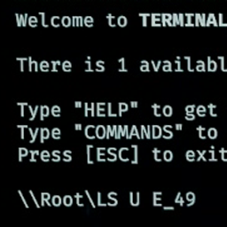

<h1 align="center">BashTerm</h1>

An Improved GTFO Terminal

# Aliases

Several shorthand aliases of commands are added to make common operations easier

| Alias                       | GTFO Command       |
| --------------------------- | ------------------ |
| `LS` / `L`                  | `LIST`             |
| `LSU` / `LU`                | `LIST U`           |
| `UC`                        | `UPLINK_CONNECT`   |
| `RS` / `START`              | `REACTOR_STARTUP`  |
| `RSD` / `SHUT` / `SHUTDOWN` | `REACTOR_SHUTDOWN` |
| `UV`[^1]                    | `UPLINK_VERIFY`    |
| `RV`[^1]                    | `REACTOR_VERIFY`   |
| `P`                         | `PING`             |
| `Q`                         | `QUERY`            |
| `CLEAR`                     | `CLS`              |

## `LSU` / `LU`

`LSU` specifically converts number-only filter to zone identifiers if applicable.

i.e. `LSU 49` would be interpreted as `LSU E_49` = `LIST U E_49`

## Item Name Expansion / Quick Concatenation

In addition to regular aliases, 

# Roadmap
- [ ] **Better Autocomplete**: Pressing tab shows the different candidates if multiple matches exist
- [ ] **Better Prompt**: Update styling of command prompt (i.e. `\\ROOT\`) to include things like zone information
- [ ] 

[^1]: Since these aliases might be consider balance-breaking to some, there are options in the config to turn these mappings off. By default, however, they are enabled.
